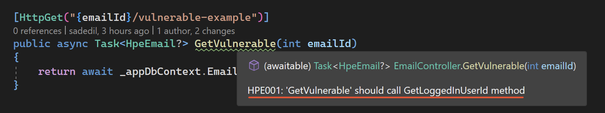

# Securing Your Code: Identifying and Preventing Vulnerabilities with Roslyn Analyzers

In this article, we're going to discuss a common security issue that can sneak into your codebase with just one mistake and explore how we can identify and fix it during the coding process.

Certain vulnerabilities can easily find their way into your code and pose significant security risks. Relying solely on reminders like "*Please be more careful*" or hoping that someone will spot them during a code review isn't a reliable solution. As developers, one of the best approaches is to implement preventive measures as early as possible, ideally without the need for human intervention, if feasible.

Let's start.

## Horizontal Privilege Escalation Vulnerability

In this article, our main focus will be on a particular security problem known as "*Horizontal Privilege Escalation (HPE)*". We aim to learn how to avoid introducing this vulnerability while writing code, even before we hit the compile button in our code editor.

*HPE* is when someone or something gains access to things they shouldn't at the same access level, without moving up in privileges. Just think about how risky it could be if *Alice* could access *Bob*'s stuff, like emails or orders.

> **Before we dive in, here are a few important points to keep in mind**
> 
> * To accomplish our goal, we'll be making use of *.NET* and *Roslyn Code Analyzers*.
> * While the code is written using *.NET 8.0 (RC1)*, it's not a strict requirement. We've chosen to utilize the new [Identity Management Features](https://devblogs.microsoft.com/dotnet/improvements-auth-identity-aspnetcore-8/) introduced in *.NET 8*, but you can adapt this to other versions if needed.
> * You have the flexibility to work with this code in various development environments, including *Visual Studio*, *Rider*, *VS Code*, or even the *dotnet command-line interface*. It's not tied to any specific integrated development environment.
> * You can access all the code examples on *GitHub* by visiting this link: 
>   * https://github.com/sadedil/HorizontalPrivilegeEscalationDemo

## Let's define the problem

Imagine we have a *REST* endpoint (`/email/{emailId}`) and users can get their emails from their inboxes which belong to themselves after they log in.

<table>
<tr>
<th> The User </th>
<th> Resource can be accessed (Email inbox in this case) </th>
</tr>
<tr></tr>
<tr>
<td>

```json
{
    "userId": 1,
    "name": "Alice",
    "email": "alice@example.com"
}
```

</td>
<td>

```json
{
    "emailId": 1,
    "subject": "Greetings Alice",
    "body": "A secret message to Alice"
}
```

</td>
</tr>
<tr></tr>
<tr>
<td>

```json
{
    "userId": 2,
    "name": "Bob",
    "email": "bob@example.com"
}
```

</td>
<td>

```json
{
    "emailId": 2,
    "subject": "Hi Bob",
    "body": "A secret message to Bob"
}
```

</td>
</tr>
</table>

Without a login, nobody can access these resources. That part will be handled by *.NET*'s Identity middlewares if you configure it once. So there is no problem here.

However, it is easy to make the controller and action method (`/email/{emailId}`) vulnerable to *HPE* for users who are already logged in with their user credentials and have obtained the `access_token`.

```csharp
    // Authorization: Bearer {{access_token}} needed to call this

    [HttpGet("/email/{emailId}")]
    public async Task<Email> GetVulnerable(int emailId)
    {
        return await _appDbContext.Emails.FindAsync(emailId);
    }
```

In the example above, anyone who logged in to the API can enumerate and get all emails including the other users have. **And that is the problem.**

> I know this is a silly example but I want to keep the examples as simple as possible to not to lose focus on the main content. Anyway, how could you rewrite this code to eliminate this problem?

```csharp
    // Authorization: Bearer {{access_token}} needed to call this

    [HttpGet("/email/{emailId}")]
    public async Task<Email> GetSafe(int emailId)
    {
        var loggedInUserId = this.GetLoggedInUserId();

        return await _appDbContext
            .Emails
            .FirstOrDefaultAsync(e => 
                e.UserId == loggedInUserId
                && e.EmailId == emailId);
    }
```

Seems like we solved the problem, Alice can not read the emails belonging to Bob (and vice versa). But what `GetLoggedInUserId()` method does?

The content could be changed with your login scenarios but in summary, it is a simple method written by me to extract the logged-in userId from the `HTTP Authorization header`. In our example I used `Controller.User.Claims` but it can be changed according to your scenario.

We've got the core logic sorted out, but now we face a new challenge: **How do we ensure that developers remember to call `GetLoggedInUserId()` in every action method of each controller?** This is where we made the decision to proceed with *Roslyn Analyzers*.

I know there are pros, cons, and even other methods you can use according to your scenario. Please check the [Questions & Answers](#questions--answers) section at the end of the article.

## Adding our first Roslyn Analyzer to our codebase

Let's begin by looking at the results first. **What will we achieve by creating the analyzer?**

Developers will receive a direct reminder if something is missing. For example, they might see a message like, "*You haven't called the `GetLoggedInUserId()` method. Do you have everything under control?*"

> Here is a screenshot taken from *Visual Studio*.
>

> **Note**
> 
> You can change the diagnostic level from `warning` to `error`. In this situation, it won't just give a warning; it will actually stop the build unless you manually suppress it.

### Establishing the Rules

Let's begin by setting up the rules for our analyzer – what should it check and enforce? In this example, we'll create an analyzer to examine a straightforward rule:

> If a public method (action) in a class inherited from `ControllerBase` doesn't call the `GetLoggedInUserId()`, it should raise a warning for the developer.

However, you have the flexibility to customize this rule to fit your specific requirements and the structure of your code. For instance:

> If a public method (action) within a class inherited from `ControllerBase`, which includes input parameters such as `emailId`, `fileId`, `documentId`, and so on, does not call the `GetLoggedInUserId()`, it should trigger a warning for the developer.

There are no bounds except for what your codebase and your imagination can come up with.

### Getting Started with Writing an Analyzer

A *Roslyn Analyzer* is essentially another *.NET* project (*assembly* or a *NuGet package*), containing your rules. To create one, you simply need to make a class that inherits from `DiagnosticAnalyzer` and follow some patterns. Fortunately, *Visual Studio* offers a project template called **Analyzer with Code Fix (.NET Standard)** that can help you set up a basic analyzer. This template also includes a unit test project for testing your analyzers.

> If you haven't worked with *Roslyn* before, digesting all the information you will be learning might be challenging at the beginning. But in the core, you can think of it like working with reflection (definitely not the same) but it allows you to work with code syntax, not runtime objects that are already compiled.

We won't dive deep into the details here; you can check the [GitHub project page](https://github.com/sadedil/HorizontalPrivilegeEscalationDemo) to see the code examples in action. In general, the workflow will be like this:

* Create an analyzer project.
* Implement your rule(s).
* Add a reference to the project you want to analyze (typically an API project).
   * This process is a bit different from adding standard project references.
   * [See the example here](https://github.com/sadedil/HorizontalPrivilegeEscalationDemo/blob/25c3411ca2848430346e2caa14743a2ad53dabfa/HorizontalPrivilegeEscalation.ExampleApi/HorizontalPrivilegeEscalation.ExampleApi.csproj#L18)
* Enjoy the process, and your analyzer will automatically start working in your IDE, showing warnings and errors in your build output.

## Questions & Answers

> **Q1**: Is there another way to prevent HPE vulnerabilities?

Yes, there are some best practices, such as:

* Encrypting resource parameters
* Using GUIDs (which are hard to guess) as IDs
* and more.

While some of these methods may add complexity to your API (like encryption), others may not provide complete security (GUID IDs).

> **Q2**: Is this method foolproof? Can it be easily bypassed?

It's not foolproof. This method can be easily bypassed, but our goal is to prevent developers from making simple mistakes, not to stop malicious intent.

> **Q3**: Why shouldn't I use `HasQueryFilter` provided by *Entity Framework Core*, which automatically adds `userId` criteria for each DB call?

It depends on your data model and code base. If your application isn't multi-tenant and doesn't have a `UserId` column in every table, or if you're using complex joins in stored procedures, you may not be able to use `HasQueryFilter`. But if this approach suits your needs, it's a better choice to use it.

> **Q4**: Can we make the analyzer project work with various projects without much hassle?

Yes and no. Instead of directly adding the *Analyzer project* to your solution, you can create a *NuGet* package and include it. However, different projects may follow different coding styles, like using `BusinessService` classes or `MediatR` for handling controller actions. Creating a one-size-fits-all solution might increase development effort. But it is not impossible.

> **Q5**: Do you use this approach in one of your projects, or is it just a proof of concept?

We actively use this approach in one of our projects with more complex rules, and we find it beneficial.

> **Q6**: What are the drawbacks?

In my experience, the hardest part was the initial implementation phase. Working with *C#* code syntax (*Roslyn*) wasn't as easy as I expected, but it became more manageable with practice.

> **Q7**: What about performance?

Each analyzer you add to your code will consume some *Memory*/*CPU* resources. However, if you're dealing with just 1 to 10 analyzers, the impact won't be noticeable to the naked eye. It will be completed in milliseconds.

> **Q8**: What's next?

I've primarily focused on addressing *Horizontal Privilege Escalation* in this article. Still, if you embrace this approach, you can apply it to prevent a wide range of potential problems proactively.

Furthermore, there are numerous ready-to-use analyzers out there. Some of them are geared towards preventing vulnerabilities, some solely concentrate on formatting your code, while others are designed to enforce the best practices. I recommend adding them to your projects and configuring their severity levels (`None`, `Silent`, `Suggestive`, `Warning`, and `Error`) according to your team's needs. You can then store these settings in a `.editorconfig` file for consistency among team members.

Here are some analyzers you can directly add to your project:

* [StyleCopAnalyzers](https://github.com/DotNetAnalyzers/StyleCopAnalyzers)
* [Roslynator.Analyzers](https://github.com/josefpihrt/roslynator)
* [Meziantou.Analyzer](https://github.com/meziantou/Meziantou.Analyzer)
* [SonarAnalyzer.CSharp](https://github.com/SonarSource/sonar-dotnet)
* [Microsoft.CodeAnalysis.NetAnalyzers](https://learn.microsoft.com/en-us/dotnet/fundamentals/code-analysis/overview?tabs=net-7)
   * Starting in *.NET 5*, these analyzers are included with the *.NET SDK* and you don't need to install them separately.

## Final words

As developers, we should aim to stop these issues from happening early in the process, ideally without needing extra help. The sooner we add these safeguards, the safer our code becomes. So, keep coding securely and protect your software and users from potential problems.
